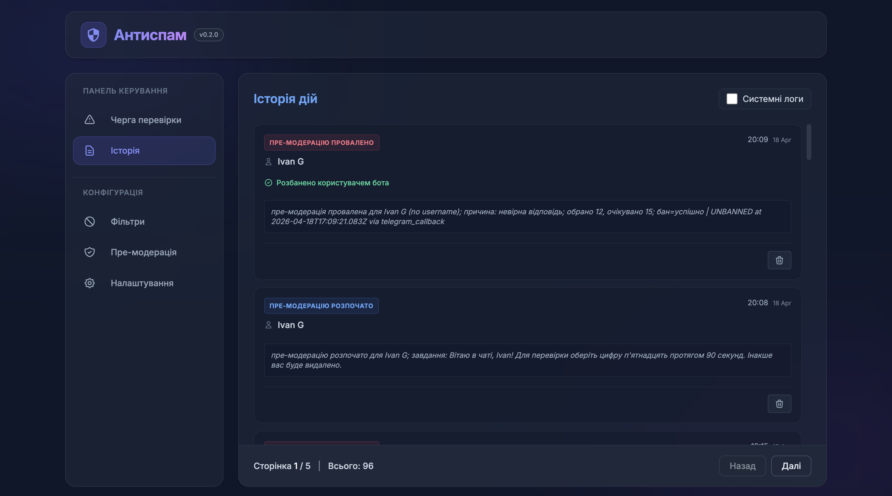

# Telegram Anti-Spam Bot (Cloudflare Workers + D1 + Queues)

Цей проект — простий антиспам-бот для Telegram, що працює на Cloudflare Workers, використовує D1 для бази даних та Queues для надійної обробки капчі. Для невеликого чату вистачить лімітів безкоштовного плану.



## Основні можливості

- **Розумна нормалізація тексту**: Ефективна боротьба зі спамом, що використовує гомогліфи (схожі за виглядом латинські літери замість кириличних), приховані Unicode-символи та інші методи обходу фільтрів.
- **Дворівнева фільтрація (Anti-Spam)**:
  - **Чорний список (Hard match)**: Негайне видалення повідомлення та постійний бан користувача.
  - **Карантин (Soft match)**: Повідомлення з підозрілими словами або посиланнями автоматично потрапляють у чергу на перевірку модератором у зручній адмін-панелі.
- **Система Премодерації (Капча)**: 
  - Нові користувачі повинні підтвердити, що вони не боти, розв'язавши просту задачу (вибір цифри, написаної словом).
  - Надійне керування таймаутами через Cloudflare Queues (навіть якщо воркер перезапуститься, капча буде оброблена).
  - Тимчасове обмеження прав користувача (read-only) до проходження перевірки.
- **Безпечний режим (Safe Mode)**: Можливість тестувати фільтри в "сухому" режимі — повідомлення не видаляються, а користувачі не баняться (система лише записує, що б вона зробила).
- **Зручна Адмін-панель**: 
  - Перегляд історії дій у реальному часі.
  - Керування чорним списком та стоп-словами.
  - Модерація карантину (схвалення або видалення повідомлень).
  - Гнучкі налаштування капчі та системних параметрів.
- **Локалізація**: Повна підтримка української мови для повідомлень у чаті та інтерфейсу керування.

## Технологічний стек

- **Core**: [Hono](https://hono.dev/) на Cloudflare Workers.
- **Database**: [Cloudflare D1](https://developers.cloudflare.com/d1/) (SQLite).
- **Background Tasks**: [Cloudflare Queues](https://developers.cloudflare.com/queues/) для таймаутів капчі.
- **UI**: Vanilla JS + Tailwind CSS.
- **Security**: Інтеграція з Cloudflare Zero Trust (Access) для захисту панелі керування.

## Швидкий запуск

Повна інструкція з розгортання знаходиться у файлі [DEPLOYMENT.md](DEPLOYMENT.md).

1. **Створення інфраструктури**:
   ```bash
   wrangler d1 create telegram_antispam
   wrangler queues create anti-spam-delay-queue
   ```
2. **Конфігурація**: Вкажіть отримані `database_id` у `wrangler.toml`.
3. **Деплой**:
   ```bash
   npm install
   npm run types
   npx wrangler deploy
   ```
4. **Налаштування**: Перейдіть за посиланням воркера `/admin` і введіть токен бота та ID чату.

## Безпека адмін-панелі

Проект спеціально не містить внутрішньої системи логіну. Шлях `/admin/*` **обов'язково** має бути захищений через Cloudflare Access (Application + Policy). Це надійніше і дозволяє використовувати ваші існуючі identity-провайдери.

---

# Telegram Anti-Spam Bot (English)

This project is a powerful Telegram anti-spam bot built on Cloudflare Workers, using D1 for database and Queues for robust captcha processing. For a small chat, the free plan limits are sufficient.


## Key Features

- **Text Normalization**: Effectively handles spam that uses homoglyphs, hidden Unicode characters, and other evasion techniques.
- **Two-tier Filtering**:
  - **Blacklist (Hard match)**: Immediate message deletion and user ban. Supports plain text and RegEx.
  - **Quarantine (Soft match)**: Suspicious messages are held for manual review in the dashboard.
- **Pre-moderation (Captcha)**: New users must solve a simple text-based captcha. Powered by Cloudflare Queues for reliable timeout handling.
- **Safe Mode**: Test your settings without actually deleting messages or banning users.
- **Modern Dashboard**: Real-time logs, blacklist management, and quarantine moderation.
- **Cloudflare Zero Trust**: Protect the dashboard with Cloudflare Access.

Refer to [DEPLOYMENT.md](DEPLOYMENT.md) for detailed setup instructions.
